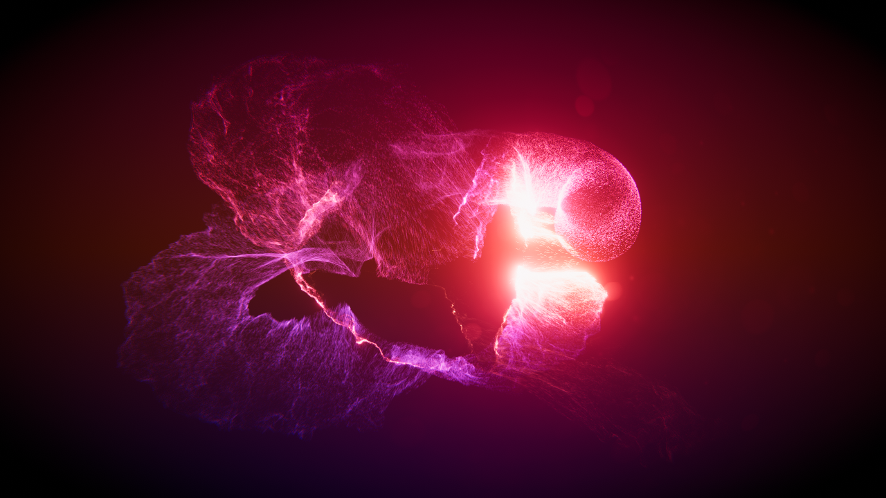

# 渲染基础 ShaderLibrary
shader语法和C++、C#等编程语言差不多，越是复杂的功能背后依赖的函数库就越多。  
shader底层是DXBC指令，DXBC更底层则是不同GPU对指令的实现。  
在Unity中对shader语法进行了一层包装，我们称之为ShaderLab语法。  
    不同渲染API的Shader有差异，如DX、Metal、Vulkan、OpenGL，而Unity是跨平台的。  
    我们能基于ShaderLab语法编写shader，根据DXBC指令进行算法优化。  
  

## 参考资料 
1.[HLSL微软官方文档](https://docs.microsoft.com/en-us/windows/win32/direct3dhlsl/dx-graphics-hlsl "HLSL微软官方文档")  
2.[Unity SRP Github](https://github.com/Unity-Technologies/Graphics "Unity SRP Github")  

# HLSL语法
编写Unity shader时，可以使用CG或HLSL风格的语法，在Unity推出SRP后普遍流行HLSL语法。  
    两种语法差不多，代码定义包含在HLSLINCLUDE/ENDHLSL或CGINCLUDE/ENDCG内即可。  
HLSL语法与C++类似，比如加减乘除余、变量/函数声明、循环控制、输入/输出等，但是也有自己的特色。  

## 基本类型
shader中基本类型有bool、uint、float等，在移动端推荐使用半精度浮点数half；  
GPU侧的并行运算效率非常高，推荐使用多分量的变量进行计算，比如float2~float4。  
	可以使用xyzw或rgba访问分量  

## 语句
例：float a = b * (c / d) - Func(e);  
一个表达式(语句)由许多变量、运算符和方法构成，以“；”结尾，包括“return”语句。  
	加减乘除余：+ - * %  
	数组/矩阵取值操作：array[i] matrix[0] matrix[0][1]   
	赋值操作：= += -= *= /= %=  
	布尔操作：&& ?:  
	比较操作：any(A4 < B4) all(A4 < B4) < > == != <= >=  
	前后置操作：++ --  
		注：多元变量运算时通常每个分量单独计算。  
		注：比较操作仅限于单个分量。  
		注：多元布尔操作返回多元bool Vector。  
		注：matrix[0]返回多元Vector。  
	显式强制转换操作： (float)i4   等同于   float(i4.x)  
	                   (float4)i   等同于   float4(i, i, i, i)  
	                   asfloat(i)  asint(f) asuint(f)   
		注：根据转换目标有精度损失。  
	二进制操作(仅对int和uint有效)： ~  <<  >>  &  |  ^  
		注：<<为数字左移，高位移出，低位补0。  
		注：>>为数字右移，低位移出，高位补符号位(正数补0/负数补1)。  
		注：^二进制的逻辑异，不同既为真。  

## 流程控制
if、for、while等C++风格的语法都可以使用，但是性能堪忧。

## 语义
语义可用来表示特殊的输入和输出，可声明在结构体内。  
这些语义分布在vertex函数输入/输出、frag函数输入/输出。  
vertex输入(模型空间数据)  
	float4 vertex : POSITION; //模型空间中的坐标   
	float3 normal : NORMAL; //法线方向  
	float4 tangent : TANGENT; //切线方向 tangent.w用于确定副法线的方向  
	float4 texcoord0 : TEXCOORD0; //第一套纹理坐标  
	float4 texcoord1 : TEXCOORD1; //第二套纹理坐标  
	float4 texcoord2 : TEXCOORD2; //第三套纹理坐标  
	float4 texcoord3 : TEXCOORD3; //第四套纹理坐标  
	float4 color : COLOR; //顶点色  
	uint vid : SV_VertexID //顶点的index，与mesh.vertex中顺序一致。  
vertex输出  
	SV_POSITION //顶点在裁剪空间中的坐标  
frag输入  
	fixed facing : VFACE; //大于0表示当前三角形是正面朝向相机：   
	UNITY_VPOS_TYPE screenPos :  VPOS //屏幕坐标  
fragment输出   
	SV_TARGET //指向第一个颜色目标RT  

## Buffer
ConstantBuffer：光栅shader常用的buffer，存储逐材质、逐帧、全局等分类的变量。  
ComputeBuffer：ComputeShader个光栅shader都可以用的，可以传递指定长度的struct队列。  

## Sampler 采样器
shader中大量使用到了贴图采用，关于采样的细节原理参考“缓存命中率.md”。  
	贴图有sRGB、mip、压缩、过滤等基础特性。  
URP默认贴图声明：`TEXTURE2D(_MainTex); SAMPLER(sampler_MainTex);`  
    `float4 _MainTex_TexelSize; float4 _MainTex_HDR`  
采样器中包含wrapping和filtering设置，有数量上限，同类型的贴图可以复用采样器。  
    比如多层采样的地形shader服用Layer1的采样器。  

简写模式：`sampler2D _MainTex;` //这个声明方式自带采样器  
自定义采样器：`SAMPLER(sampler_Linear_Clamp);` //可使用字符串拼接的方式声明采样器  

采样语法： 
`half4 value = _Ramp.Sample(sampler_Ramp, float2(intensity, 0));`  
`half4 value = tex2D(_Ramp, uv.xy);`  //使用自带采样器  
`half4 value = SAMPLE_TEXTURE2D(_Ramp, Sampler, uv.xy);`  

## 内置函数 
内置函数是hlsl是已经存在的接口，经过ShaderLab的封装后供我们使用。  
	很多列表里的函数实际上没被用到过，通常我们都是基于Unity使用经验来谈。  
像normalize、smoothstep等函数实际上由多个指令构成，我们需要了解函数底层实现。  

### 类型转换
asdouble(x, y) ：将2个uint Vector转换为1个double Vector，分量数不变。  
asfloat(x) ：将1个任意Vector转换为float Vector。  
asint ：将1个任意Vector转换为int Vector。  
asuint ：将1个任意Vector转换为uint Vector。   
f16tof32(x) ：返回x(被保存为unit的16位浮点数)的32位浮点数表达形式。  
f32tof16(x) ：返回x(32位浮点数)的16位浮点数表达形式(被保存为unit)。  

### 浮点数操作
floor(x) ：如果x有小数部分，返回比x小的最大整数，floor(-2.3) = -3。  
ceil(x) ：如果x有小数部分，返回比x大的最小的整数。  
trunc(x) ：逐分量去除小数部分，trunc(-2.3)= -2。  
abs(x) ：返回逐分量的绝对值，abs(-1)为1。   
clamp(x, min, max) ：将X的值限制在min和max之间。  
    if(x < min) retrun min;  
    if(x > max) retrun max;  
    else 		retrun x;  
saturate(a) ：等效于clamp(x, 0, 1)  
fmod(x, y) ：取余，返回x/y的小数部分。  
frac(x) ：返回x的小数部分。  
round(x) ：返回逐分量四舍五入。  
max(x, y) ：返回逐分量最大值。  
min(x, y) ：返回逐分量最小值。  
sign(x) ：相当于if(x<0) return -1;if(x>0) return 1; return 0;。  

### 三角函数
三角函数的使用容易引起手机发热，可适当优化。  
弧度乘以57.29578转换为角度。  
如果需要将角度转化为弧度，那么就是乘以0.0174532924。  

sin(x) ：返回x(弧度)的正玄值。  
cos(x) ：返回x(弧度)的余玄值。  
tan(x) ：逐分量返回x(弧度)的正切值。  
degree(x) ：将x(弧度)转化为角度。 
radians(x) ：将角度x转换为弧度。  
sincos(x, s, c) ：void，将x(弧度)的sin值和cos值分别赋值到s和c。  

asin(x) ：返回逐分量(在-1至1范围内)的反正玄值(弧度)。  
acos(x) ：返回逐分量(在-1至1范围内)的反余玄值(弧度)。  
atan(x) ：返回逐分量的反正切值(弧度)。  
atan2(y, x) ：返回向量(x, y)与X轴的反正切值(弧度)。  
    由于x和y可以表达坐标所处在的象限，计算的结果比atan更稳定。  

双曲函数：https://zhuanlan.zhihu.com/p/548599449  
sinh(x) ：双曲线正玄函数。 
cosh(x) ：双曲线余玄函数。 
tanh(x) ：双曲线正切函数。 

### 逻辑运算
all(x) ：如果x的所有分量都不为0，返回true；否则返回false。  
any(x) ：如果x的任一分量不为0，返回true；否则返回false。  
countbits(x) ：返回逐分量(uint类型)的二进制格式中1的位数。   
firstbithigh(x) ：返回逐分量(int或uint)的二进制格式中从高位数第一个1的位置。  
firstbitlow(x) ：返回逐分量(uint)的二进制格式中从低位数第一个1的位置。  
step(a, b) ：等效于(b >= a) ? 1 : 0  

### 特殊功能
clip(x) ：如果x的任意分量小于0，则忽略当前片元；也就是透明度测试AlphaTest。  
isfinite(x) ：逐分量判断浮点数的值是否为finite(有限的)。  
isinf(x) ：逐分量判断浮点数的值是否为infinite(无限的)。  
isnan(x) ：逐分量判断浮点数的值是否为NAN或QNAN。  

### 指数函数
exp(x) ：返回以自然数e(2.71828)为底数，x为指数的值。  
log(x) ：求对数，返回以e为底数，x为值时对应的指数。  
exp2(x) ：返回以2为底数，x为指数的值。  
log2(x) ：求对数，返回以2位底数，x为值时对应的指数。  
log10(x) ：求对数，返回以10为底数，x为值时对应的指数。  
pow(x, y) ：幂运算，x为底数，y为指数，等价于exp2(log2(x) * y)。  
	底数为0时结果可能异常。  

### 常规函数
rcp(x) ：逐分量返回近似倒数。  
distance(x, y) ：返回x和y(Vector)之间的距离，√((xa-xb)² + (ya-yb)²)。  
length(x) ：返回x(Vector)的长度。  
dot(x, y) ：返回x和y(Vector)的点积，xa * xb + ya * yb。  
mad(a, x, y) ：返回a * x + y，执行速度快。  
fma(a, x, y) ：相比mad运算精度更高。  
lerp(x, y, a) ：等效于x + a(y-x)。  
noise(x) ：Perlin噪声函数，返回值在-1至1内。  
normalize(x) ：归一化x(Vector)。  
reflect(input, normal) ：input为入射方向，求反射方向。  
	return input - 2 * normal * dot(input, normal);  
refract(input, normal, 折射率) ：求折射方向。  
rsqrt(x) ：逐分量平方根的倒数。  
smoothstep(x, y, a) ：类似于clamp(a, x, y)，做曲线映射, x * x * (3 - 2 * x)。  
sqrt(x) ：逐分量返回x的平方根。  

### 矩阵操作
mul(x, y) ：矩阵相乘；矢量在右边时，被竖排序；矢量在左边时，被横排序。  
transpose(x) :返回x(矩阵)的转置矩阵(将行列互换)。  
cross(x, y) ：返回x和y(参数为多组件Vector类型)的叉积。  

### 采样
tex2D(sampler, uv) ：默认采样语法，仅用于片元shader。  
    底层会基于uv的ddx和ddy推导mip等级，实现双线性/三线性过滤。  
    因为在顶点Shader阶段没有生成片元，无法产生ddx和ddy，不能用于顶点Shader。  
tex2D(sampler, uv, ddx, ddy) ：使用指定的偏导数替代uv的偏导数  
tex2Dlod(sampler, uv) ：相比tex2D，在uv.w中指定mip等级。  
    在只需要特定mip时tex2Dlod无需计算mip性能更优。  
    在3D场景贴图采样时tex2D自动计算mip纹理缓存命中率更高。  
tex2Dbias(sampler, uv) ：相比tex2D，在uv.w中指定mip等级偏移。  
tex2Dproj(sampler, uv) ：相比tex2D，uv是屏幕UV需要除以w分量：uv.xy / uv.w  
tex2Dgrad(sampler, uv, ddx, ddy) ：同tex2D(sampler, uv, ddx, ddy)    
Load(int3(unCoord2, lod)) ：加载指定像素坐标、指定mip的像素，无过滤。  
Gather(sampler, coord2) ：加载指定像素坐标的像素，不支持mip，有过滤。  
    支持采样单通道：GatherRed/GatherGreen/GatherBlue/GatherAlpha  

### 异步指令
GroupMemoryBarrierWithGroupSync() ：异步读写时，等待group内线程逻辑执行到此调用。  
ddx(x)：求返回变量x在向量像素之间的落差(偏导数)。  
	片元2x2作为一组并行执行，假设x为世界空间高度，那么ddx可以计算横向向量像素的高度差。  
	通过ddx、ddy、世界坐标，可以得出某一点的世界空间法线。  
	因为变量在不同像素里值不一样于是产生了梯度，如果x是衡量那么产生的梯度为0.  
ddx_coarse(x) ：返回x的低精度偏导数。  
ddx_fine(x) ：返回x的高精度偏导数。  
ddy(y)/ddy_coarse/ddy_fine ：参考ddx。  
fwidth(x) ：返回abs(ddx(x)) + abs(ddy(x))。  

# 常用函数
Builtin、URP、HDRP的Shader库都很有学习价值，在做效果方面连连看的节点库非常实用。  
常用函数可以说是无限多的，我们需要收集整理，总结出函数的使用经验。  
Unity做了很多平台兼容和版本迭代，很多改动对特定项目来说都不是必要的，需要我们了解底层实现。  

## 图片预处理类型函数
噪音贴图对比度：控制噪音细节的强弱。  

## 矩阵类函数
float3 TransformObjectToWorld(float3 positionOS)：模型空间to世界空间  
float4 TransformWorldToHClip(float3 positionWS)：世界空间to裁剪空间  
float3 TransformObjectToWorldNormal(float3 normalOS, bool doNormalize = true)：世界空间法线  
	利用矩阵实现对顶点、向量的缩放、旋转、偏移等常规操作，需自行判断是否需要归一化。  
	矩阵的运用非常灵活，比如渲染球型草时用顶点坐标当法线；用观察空间xy平面的坐标当投影平面。  

## 视口类函数
float4 ComputeScreenPos(float4 positionCS)：计算屏幕空间UV  
	该方法需要在顶点shader中调用，在片元shader中进行齐次去除补偿。  
现在很多效果都要采样深度重建世界坐标，比如水、高度雾、场景扫描。  
	拿水举例，水通常是一个面片，河底是地形系统，需要根据水面的水下深度进行透明渐变、折射。  
	
# 光照模型
目前业界主要是PBR渲染和卡通渲染。  
PBR渲染：光照分为4个部分相加构成，环境漫反射、环境镜面反射、直接光漫反射、直接光镜面反射。  
卡通渲染：基础色、漫反射、镜面反射、自发光。  
	漫反射：一般使用兰伯特漫反射，有比较柔和的渐变。  
	镜面反射：基于观察方向和光源方向提供局部强烈的小光斑效果，比如BlinnPhong高光、GGX微表面反射。  