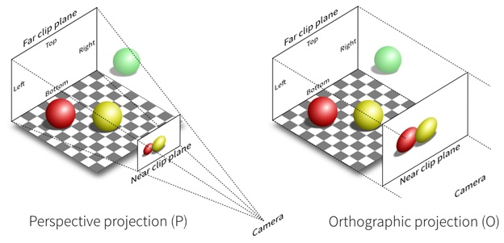
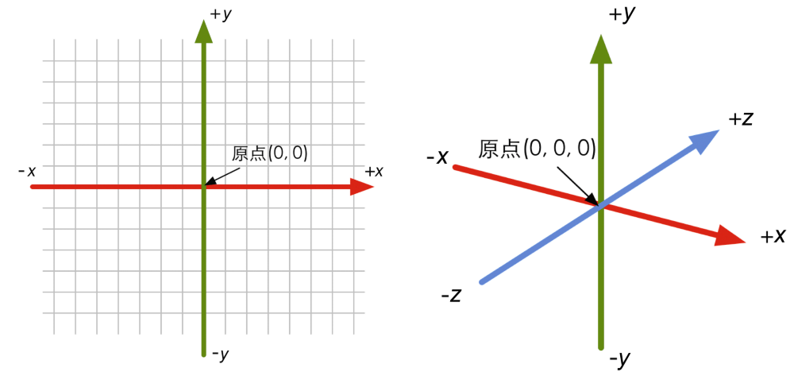
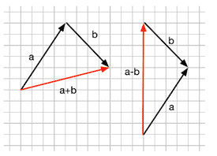
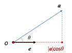
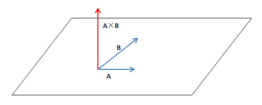
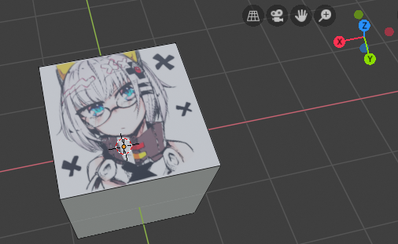
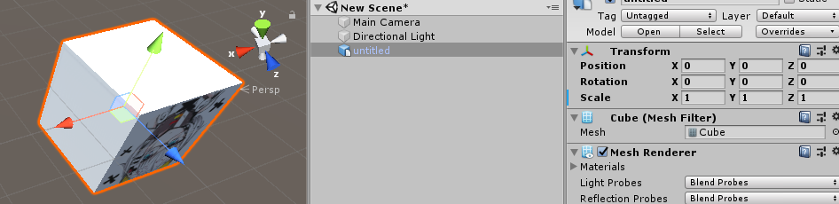
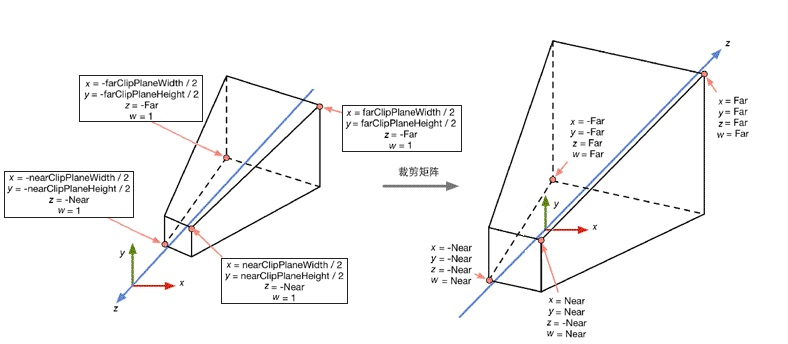
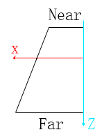
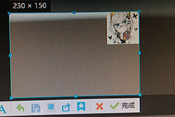

# 渲染基础-图形数学
本篇中讨论在shader中执行浮点运算时不能避免的几何数学问题  
几何数学的应用非常广泛，我们先从基础运算规则讲起，再推导一次投影。  
  

# 参与计算的基础元素

## 坐标系
 

比较常见的情况是2D坐标系和3D坐标系，3D坐标系又分为左手坐标系和右手坐标系。  
比较少见的是经纬度坐标系(以距离中心距离和角度来测量)、距离场等。  

在Unity的Scene视图，可以看到如图所示的这种坐标系，即左手坐标系。  
    右手坐标系和左手坐标系在X轴和Y轴同向时，Z轴相反  
    描述3D坐标系时使用上下左右内外等词汇比较容易引起误会  

## 三角函数
π=180°  
sin：对边/斜边  
cos：临边/斜边  
tan：对边/临边  
cot：临边/对边  

## 矢量

### 矢量相加：矢量 + 矢量 = 矢量
  

### 矢量点积：矢量 · 矢量 = 标量
  

可用于求夹角β、验证向量方向性。  
    $dot(\overrightarrow{A}, \overrightarrow{B}) = |\overrightarrow{A}| * |\overrightarrow{B}| * cos\beta$  
    $dot((x, y, z), (a, b, c)) = ax + by + cz$  

### 矢量叉积：矢量 ✖ 矢量 = 矢量
  

可用于求夹角β，验证三角面的朝向。    
    $cross(\overrightarrow{A}, \overrightarrow{B}) = |\overrightarrow{A}| * |\overrightarrow{B}| *  sin\beta$  
    $(x, y, z)\times (a,b,c) = (yc − zb, za − xc, xb − ya)$  
    平行的轴避免叉乘，交换叉积顺序导致结果反向。  

## 矩阵    
$$
M = \begin{bmatrix}
	m_{00} & m_{01} & m_{02} \\
	m_{10} & m_{11} & m_{12} \\
	m_{20} & m_{21} & m_{22} \\
\end{bmatrix}
$$

在3D几何中，矩阵表示变换，可以将一个顶点或向量进行平移/旋转/缩放。  
    $M_{ij}$表示一个有i排j列的矩阵  
    在Shader中取值时，M[0]表示第一排全部元素，M[0][1]表示第一排第2个元素。 

### 矩阵与标量相乘：矩阵 * 标量 = 矩阵
$$
kM = Mk = k * \begin{bmatrix}
    m_{00} & m_{01} & m_{02} \\
    m_{10} & m_{11} & m_{12} \\
    m_{20} & m_{21} & m_{22} \\
\end{bmatrix} = \begin{bmatrix}
    km_{00} & km_{01} & km_{02} \\
    km_{10} & km_{11} & km_{12} \\
    km_{20} & km_{21} & km_{22} \\
\end{bmatrix}
$$  

### 矩阵与矩阵相乘：矩阵A * 矩阵B = 矩阵C
$$
\begin{matrix}
& \begin{bmatrix}
    b_{00} & b_{01} & b_{02} & b_{03} \\
    b_{10} & b_{11} & b_{12} & b_{13} \\ 
\end{bmatrix} \\
\begin{bmatrix}
    a_{00} & a_{01} \\
    a_{10} & a_{11} \\
    a_{20} & a_{21} \\
    a_{30} & a_{31} \\
\end{bmatrix} & \begin{bmatrix}
    c_{00} & c_{01} & c_{02} & c_{03} \\
    c_{10} & c_{11} & c_{12} & c_{13} \\
    c_{20} & c_{21} & c_{22} & c_{23} \\
    c_{30} & c_{31} & c_{32} & c_{33} \\
\end{bmatrix}
\end{matrix}
$$

$$
c_{00} = a_{00} * b_{00} + a_{01} * b_{10}
$$

矩阵相乘，记作 $M_{c} = M_{a} * M_{b} = mul(M_{a}, M_{b})$ 。

### 矩阵与矢量相乘：矩阵 * 矢量 = 矢量  
矢量需先转化为矩阵，矢量在右边时作为列矩阵，矢量在左边时作为行矩阵。   
矩阵与矢量的相乘可实现顶点位移、向量旋转、向量缩放等操作。  

### 顶点位移
$$
\begin{matrix}
& \begin{bmatrix}
    x \\
    y \\
    z \\
    1 \\
\end{bmatrix} \\
\begin{bmatrix}
    1 & 0 & 0 & t_{x} \\
    0 & 1 & 0 & t_{y} \\
    0 & 0 & 1 & t_{z} \\
    0 & 0 & 0 & 1 \\
\end{bmatrix}
& \begin{bmatrix}
    x + t_{x} \\
    y + t_{y} \\
    z + t_{z} \\
    1 \\
\end{bmatrix}
\end{matrix}
$$

(x, y, z, 1)中的1是齐次坐标表示法，也可使用3X4矩阵运算。

### 绕X+轴顺时针旋转
$$
R_{x}(\beta) =
\begin{bmatrix}
    1 & 0           & 0         \\
    0 & cos\beta    & -sin\beta \\
    0 & sin\beta    & cos\beta  \\
\end{bmatrix}
$$

$mul(R_{x}(\beta), (1, 0, 0)) = (1, 0, 0)$，相当于X轴无变化。  
$mul(R_{x}(\beta), (0, 1, 0)) = (0, cosβ, sinβ)$，相当于Y轴向Z轴旋转β角度。  
$mul(R_{x}(\beta), (0, 0, 1)) = (0, -sinβ, cosβ)$，相当于Z轴向-Y轴旋转β角度。  

### 绕Y+轴顺时针旋转
$$
R_{y}(\beta) =
\begin{bmatrix}
    cos\beta & 0 & sin\beta & 0 \\
    0 & 1 & 0 & 0 \\
    -sin\beta & 0 & cos\beta & 0 \\
    0 & 0 & 0 & 1 \\
\end{bmatrix}
$$

### 绕z+轴顺时针旋转
$$
R_{z}(\beta) =
\begin{bmatrix}
cos\beta    & -sin\beta & 0 \\
sin\beta    & cos\beta  & 0 \\
0           & 0         & 1 \\
\end{bmatrix}
$$

### 缩放
$$
\begin{bmatrix}
k_{x}  & 0     & 0     & 0 \\
0      & k_{y} & 0     & 0 \\
0      & 0     & k_{z} & 0 \\
\end{bmatrix}
$$

### 复合变换
Unity中约定变换的顺序为：缩放、旋转Z，旋转X，旋转Y、平移  
即 $M * R_{y}(\beta) * R_{x}(\beta)* R_{z}(\beta) * S * \overrightarrow{A} = \overrightarrow{B}$  
向量A先与缩放矩阵S相乘，执行顺序从右往左。  

### 竖向填充矩阵
假设将一个向量从空间A转换到空间B时，使用了3x3的M矩阵。  
    那么将空间A的X轴(1, 0, 0)转换到空间B 得到向量x  
    同理转换空间A的Y轴和Z轴到空间B 得到向量y和z  
    x等于M矩阵第一列 y等于M矩阵第二列 z等于M矩阵第三列  
对于公式 $\overrightarrow{B} = mul(M, \overrightarrow{A})$，M是由x、y、z构成的竖向填充矩阵  
    x、y、z分别是空间A的X、Y、Z轴在空间B中的映射  
如果用x、y、z进行横向填充构成矩阵N，能实现 $\overrightarrow{B} = mul(\overrightarrow{A}, N)$  
    A在mul运算的左侧，N是M的转置矩阵，和之前的计算等价，稍后会总结几何运算规律。  

### 模型空间to切线空间
已知模型空间下的t|b|n三个向量和模型空间的向量V，需要将V转换到切线空间。  
切线空间的X|Y|Z轴对应模型空间的t|b|n向量，模型空间到切线空间的矩阵为M。  
那么X = mul(M, t)，Y = mul(M, b)，Z = mul(m, n)，求M；  
    可以看到直接求M太困难了，换一个思路求M的逆矩阵N。  
因为模型空间到切线空间的矩阵M是一个正交矩阵，其逆矩阵N是矩阵M的转置矩阵。  
tbn刚好构成切线空间XYZ轴在模型空间的映射，N等于tbn构成的竖向填充矩阵。  
    则M为tbn构成的横向填充矩阵。   

### 空间转换
在实际业务中经常需要做空间转换，切线空间、模型空间、世界空间、观察空间都是常用空间。  
    切线空间通常用来做视差偏移、切线空间的法线、沿着切线方向流动的高光等；  
    模型空间可以用来处理模型内部的相对位置关系；   
    世界空间可以处理整个场景中大量物体的相对位置关系，做光照运算。  
    观察空间可以基于相机视角做运算，比如基于观察空间深度的渐变等。  

### 单位矩阵
单位矩阵经常作为矩阵初始化时的默认值，记作E。  
单位矩阵斜对角均为1，任何矩阵和单位矩阵相乘的结果都是原来的矩阵。   

$$
\begin{bmatrix}
1 & 0 & 0 \\
0 & 1 & 0 \\
0 & 0 & 1 \\
\end{bmatrix}
$$

### 矩阵变换
转置矩阵：将原矩阵的行列对调后得到转置矩阵。  
正交矩阵：正交矩阵和他的转置矩阵的乘积是单位矩阵。  
逆矩阵： $\overrightarrow{B} = mul(M, \overrightarrow{A});$   $\overrightarrow{A} = mul(M^{-1}, \overrightarrow{B});$  
正交矩阵的转置矩阵和逆矩阵是一样的，在shader计算中广泛用转置矩阵代替逆矩阵。  

# 计算一次从模型空间到屏幕
在实际应用中，我们经常要推导一个像素可能出现的位置；  
对渲染管线中的部分流程的理解非常重要，比如顶点-光栅化-片元；  
说再多不如自己手动推导一次像素在屏幕的位置，从而熟悉shader计算流程。  

## 模型空间-世界空间
这里是顶点shader的开始，模型数据从CPU端传递到GPU端，模型又由大量的三角形构成。  
顶点通道中记录了逐顶点的数据，包括模型空间的顶点、法线、UV等。  

### 在建模软件设置Cube     
模型一般在建模软件中制作，这里我使用Blender中的默认Cube，给其中一个面绘制贴图来表示正面；  
这个面的右上角就是我想要计算的顶点，这里记作点P，在Blender中坐标为(-1, -1, 1)。  
  

### 模型导入Unity(一些非常基础的操作)  
将Cube模型导入Unity，模型导入设置中反选掉Convert Units；  
将模型拖入场景，Reset模型GameObject的Transform属性；  
  

通过观察得出Cube模型的宽度为2个Unit，点P在世界空间中的位置为(1, -1, 1)。  
    这里获取顶点坐标的方式不严谨，仅用于新手入门教学。  

### 不同软件之间的坐标轴差异  
点P在Blender中的位置是(-1, -1, 1)，在Unity中是(1, -1, 1), 我们可以推导下转换过程。  
如果要在Unity中实现和Blender中一样的透视效果，需要在Unity中将模型绕X轴旋转-90度。  
整体流程：Unity.xyz = Blender.xyz => M => K(绕X轴旋转-90度);  
    首先在模型转换过程中，对xyz轴向进行调整(M)，然后在Unity中旋转模型(K)。  
    Unity中的轴和Blender中的轴的对应关系是：Unity.xyz = Blender.xzy * (-1, 1, -1)  
    通过矩阵运算可知：mul(K, Blender.xyz) = Blender.xzy * (1, 1, -1)    
    M的作用为反转X轴，即左手坐标系和右手坐标系的差异是：在Y轴和Z轴同向时X轴相反。  

### 旋转模型
为了让贴图了的那一面正着显示在屏幕上，将Rotation设置为(180, 0, 0)；  
计算P在世界空间中的新位置：cos180 = -1，sin180 = 0，得到点(1, 1, -1)。  

$$
\begin{matrix}
& \begin{bmatrix}
    1 \\
    -1 \\
    1 \\
    1 \\
\end{bmatrix} \\
\begin{bmatrix} 
    1 & 0 & 0 & 0 \\
    0 & cos\beta & -sin\beta & 0 \\
    0 & sin\beta & cos\beta & 0 \\
    0 & 0 & 0 & 0 \\ 
\end{bmatrix}
& \begin{bmatrix}
    1 \\
    1 \\
    -1 \\
    1 \\
\end{bmatrix}
\end{matrix}
$$

## 世界空间-观察空间
观察空间是从摄像机的观察角度去描述空间关系，和世界空间类似。  
观察空间是一个**未经缩放**过的三维空间，对世界空间进行旋转、平移、反转Z即可。  
    注意：相机Transform的旋转和平移在构建矩阵时需要逆运算  
新建的默认场景，相机的rotation为(0, 0, 0)，position为(0, 1, -10)。  
使用相机的Transform构建WorldToView矩阵，算出点P在观察空间位置为得到(1, 0, 9)。  

$$
\begin{matrix}
& \begin{bmatrix}
    1 \\
    1 \\
    -1 \\
    1 \\
\end{bmatrix} \\
\begin{bmatrix}
    1 & 0 & 0 & 0 \\
    0 & 1 & 0 & -1 \\
    0 & 0 & 1 & 10 \\
    0 & 0 & 0 & 1 \\
\end{bmatrix}
& \begin{bmatrix}
    1 \\
    0 \\
    9 \\
    1 \\
\end{bmatrix}
\end{matrix}
$$

相机的模型空间与观察空间Z轴相反，还需要应用一个Z反转矩阵：

$$
\begin{bmatrix}
    1 & 0 & 0 & 0 \\
    0 & 1 & 0 & 0 \\
    0 & 0 & -1 & 0 \\
    0 & 0 & 0 & 0 \\
\end{bmatrix}
$$

P点其实没有动过，它在不同空间里面有不同的版本只是换了一个描述角度而已。  
到这里，我们获得了在观察空间下P点的位置(1, 0, -9)。  
经过Z反转后，视椎体内的Z值为负，所以求观察空间深度时通常会反转Z的符号。  

## 观察空间-裁剪空间
裁剪空间进一步模拟视角。 

### 视椎体
视椎体是用来描述可见范围的包围盒，由近平面、远平面、4个边角连线构成。  
本篇的主旨不在推导公式，这里直接抛出公式，主要讲相关应用。  
Aspect：为屏幕的宽度/高度，近屏幕和原平面有相同的Aspect。  
透视裁剪矩阵 $M_{frustum}$： 透视相机可以模拟出近大远小的效果。  

$$
M_{frustum} = \begin{bmatrix}
    \frac{cot\frac{Fov}{2}}{Aspect} & 0 & 0 & 0 \\
    0 & cot\frac{Fov}{2} & 0 & 0 \\
    0 & 0 & -\frac{Far+Near}{Far-Near} & -\frac{2\cdot Near\cdot Far}{Far - Near} \\
    0 & 0 & -1 & 0 \\
\end{bmatrix}
$$

在 $M_{frustum}$中，对x、y、z分量进行的不同程度的缩放，z分量还做了平移。  
 

图中左右两个视椎体分别对应观察空间和裁剪空间。  
除了XYZ轴缩放，原点位置从近平面外侧移 $2\cdot Near$ 到了视锥体内，8个角落点仅用Near和Far描述。  

 

在视椎体内的顶点的各分量范围均有限制，w等于顶点在观察空间的深度的绝对值。  
$-w≤ x ≤ w$  
$-w≤ y ≤ w$  
$-w≤ z ≤ w$  
当xyz不在范围内时表示这个点不在视锥体内，裁剪矩阵基于此特性快速判断三角形的可见性。  

### 正交相机
正交相机下物体不会因为远近变化而改变大小，2 * 相机Size = 近/远平面高度。  

$$
M_{ortho} = \begin{bmatrix}
    \frac{1}{Aspect\cdot Size} & 0 & 0 & 0 \\
    0 & \frac{1}{Size} & 0 & 0 \\
    0 & 0 & -\frac{2}{Far-Near} & -\frac{Far+Near}{Far+Near} \\
    0 & 0 & -1 & 0 \end{bmatrix} \\
$$


### 应用P矩阵
在上一步中，我得到了点P在观察空间中的位置(1, 0, -9)，且设置屏幕比例为4:3。   
相机是透视模式，Near=5，Far=10，Fov为60度， $cot30^\circ = \sqrt{3}$。  
使用透视裁剪矩阵乘以(1, 0, -9, 1)后得到(1.299, 0, 7, 9)，这个点在视椎体内。  

## 透视裁剪空间-NDC
接下来需要对透视裁剪空间中的顶点P进行**齐次去除**，x、y、z分量都除以w分量。  
透视裁剪空间此时变成了和正交裁剪空间一样的正方体。   
点P的x、y、z分量除以W分量后得到新顶点(0.1443, 0, 0.7778)；  
新坐标系称为NDC(Normalized Device Coordinates)，xyz分量的范围都是[-1, 1]。  

## NDC-屏幕空间
我们用的显示屏由大量的像素颗粒构成，这里设置屏幕为400X300像素。  
以屏幕左下角为原点建立坐标轴，可以用宽高的百分比、像素为位置描述。  
NDC坐标换算成百分比坐标： $(x, y) = (0.5 * a + 0.5，0.5 * b + 0.5)$  
百分比坐标换算成像素坐标： $(x, y) = (a * 400, b * 300)$  
将NDC坐标(0.1443, 0, 0.7778)带入后得到百分比坐标(0.57215, 0.5)，像素坐标(229, 150)：  
使用QQ截图可测量像素宽度(有2个像素左右误差)，得到计算结果与测量结果接近。  


# 几何计算规律

## 矩阵乘法结合律
$(A\cdot B)\cdot C = E$  那么  $A\cdot (B\cdot C) = E$  
    即：mul(mul(a, b), c) = mul(a, mul(b, c))  
在Unity种ObjectToWorld矩阵构建顺序是缩放、旋转Z、旋转X、旋转Y、平移。  
调整操作顺序会导致结果出现变化，根据结合律可以合并多个操作对应的矩阵。  

## 正交矩阵
如果 $A\cdot A^T = E$，E为单位矩阵，则A为正交矩阵。  
例： $B = 5E; B\cdot B^T ≠ E$，正交矩阵的3个轴需要为单位向量，去除缩放和平移影响。  

转置矩阵定义：将矩阵的横排与列排交换，总能转置。  
$(A\cdot B)^T = B^T \cdot A^T$  

逆矩阵定义：能取消一个矩阵的相乘效果的矩阵，几何上总能逆。    
$M\cdot M^{-1} = M^{-1}\cdot M = E$  
$(M^{-1})^{-1} = M$  

逆转置矩阵：一个矩阵先求逆再转置，或者转置换再求逆，几何上总能逆转置。  
$(M^T)^{-1} = (M^{-1})^T$  
$(A\cdot B)^{-1} = B^{-1}\cdot A^{-1}$  
$(A\cdot B\cdot C\cdot D)^{-1} =D^{-1}\cdot C^{-1}\cdot  B^{-1}\cdot A^{-1}$  

## 转置矩阵的活用
当B是由矢量b转化为的矩阵时，可以横着被右乘或者竖着左乘矩阵。  
因为逆矩阵是非常难求的，我们经常用正交矩阵的转置作为逆矩阵，可简化求逆过程。  
$A\cdot \overrightarrow{b} \implies A\cdot B = (B^T \cdot A^T)^T = \overrightarrow{b} \cdot A^T$  
$A^T\cdot \overrightarrow{b} \implies A^T\cdot B = (B^T \cdot A)^T = \overrightarrow{b} \cdot A$  

## 等比例缩放物体求逆矩阵
使用 $\frac{1}{K}\cdot$ UNITY\_MATRIX\_T\_MV作为ObjectToWorld的逆矩阵，K为缩放系数。

## 转置矩阵矫正法线方向
```text
#ifdef UNITY_ASSUME_UNIFORM_SCALING
    output.normalWS = mul((float3x3)GetObjectToWorldMatrix(), input.normalOS);
#else
    output.normalWS = mul(input.normalOS, (float3x3)GetWorldToObjectMatrix());
#endif
```
我们对法线的定义是与表面垂直的向量，那么法线在世界空间与模型空间都应该垂直于表面。  
当模型被非等比例缩放时，使用ObjectToWorld矩阵乘以法线得到的新矢量不再与表面垂直。  
设ObjectToWorld矩阵为M，T为模型空间的切线向量，N为法线向量，期望的矩阵为G。  
$\overrightarrow{(M\cdot \overrightarrow{T})}\cdot \overrightarrow{(G\cdot \overrightarrow{N})} = 0$  
转换到世界空间后的切线和法线也应该垂直，也就是2个向量的点积为0。  
如果把切线当成横向矩阵，法线当竖向矩阵，两个矩阵相乘模仿点积，结果也应为0。  
$(M\cdot \overrightarrow{T})^T\cdot (G\cdot \overrightarrow{N}) = 0$  
$\overrightarrow{T}^T\cdot M^T\cdot G\cdot \overrightarrow{N} = 0$  

由于 $\overrightarrow{T}^T\cdot \overrightarrow{N} = 0$，如果 $M^T\cdot G = E$ 上式即可成立。  
即 $G =(M^T)^{-1} = (M^{-1})^T$，活用转置后： $G\cdot \overrightarrow{N} = \overrightarrow{N}^T\cdot M^{-1}$。  
这里的 $M^{-1}$ 也就是求ObjectToWorld矩阵的逆矩阵，WorldToObject矩阵。  
如果物体是等比例缩放，就可以简化求逆过程；对于非统一缩放物体就必须计算逆矩阵了。  

## 线性变换
可以保留矢量加和标量乘的变换，使用3X3矩阵。  
$f(x) + f(y) = f(x + y)$  
$k\cdot f(x) = f(k\cdot x)$  
其中f(x)表示一个矩阵变换过程。 变换后相加=先相加后变换，先标量乘再变换=先变换再标量乘。  
符合线性变换规律的有：缩放、旋转、错切、镜像、正交投影。   
错切（shear）：比如移动正方形的一边使其变成一个平行四边形。   
正交投影：观察空间-正交裁剪空间，去除位移部分，相当于把一个长方形变成正方形。  