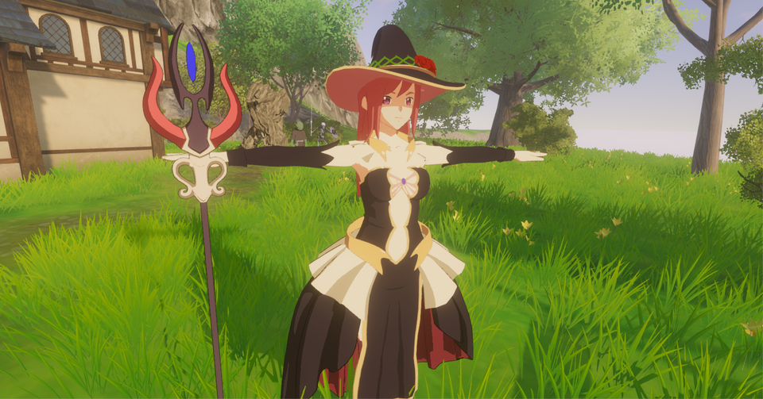
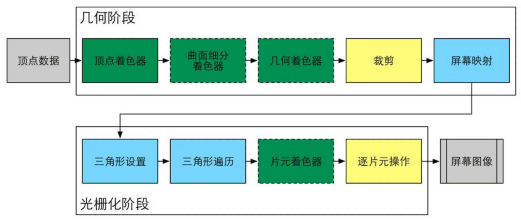
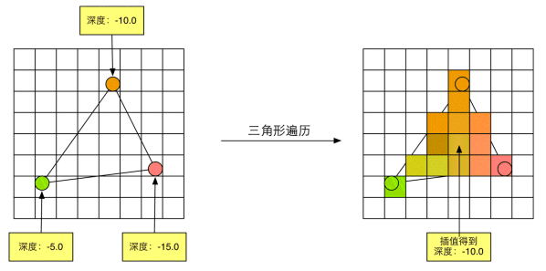
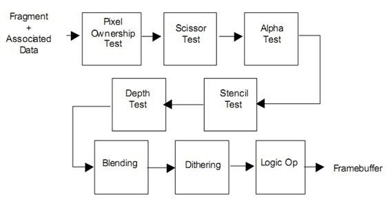

# 渲染基础-Pipeline
渲染都是以DrawCall为单位进行绘制的，Pipeline则是描述执行一个DrawCall的细节。  
与Pipeline相对的则是渲染流程，规划每一帧按顺序执行多个DrawCall完成最终的图像。  
本篇基于Unity使用经验来总结Pipeline细节。  
  

## 参考资料
[《Shader入门精要》](https://github.com/candycat1992/Unity_Shaders_Book)  
[Unity手册](https://docs.unity3d.com/Manual/SL-ShaderPrograms.html)  

## 为什么要学ShaderLab
现在有很多连连看类型的工具可以实现无代码化写Shader了，但是连连看有一定弊端。  
在demo验证阶段快速出效果验证是比较好的，但是缺乏约束，难以优化。  
需要开发人员有能力对Shader进行功能分析、性能优化、Debug，不损失效果的情况下给出最精简的代码。  

# 渲染流水线解释
  

DrawCall的执行包括多个阶段，有些可配置，有些可编程。  
对应可配置的部分，需要了解这些流程都干了啥、可用的选项/开关的具体效果；  
对应可编程的部分，需要了解对应的效果实现，输入与输出。  

## 应用阶段 
应用阶段在几何阶段之前，指CPU通过向GPU提交DrawCall来发起一次渲染；  
DrawCall必要的资源和设置，输入、输出、着色器、渲染状态，都已准备就绪。  
在C#侧通过CommandBuffer API来管理渲染流程，了解CommandBuffer有助于理解DrawCall。  
   我们可以查看每一个命令对应的模型、材质球、RT目标等。  

渲染相关的数据  
全局参数：时间、环境色  
Camera：相机位置，V矩阵、P矩阵  
光源：光源位置，光源空间矩阵、环境光  
逐顶点数据：POSITION、NORMAL、TANGENT、TEXCOORD0~5、COLOR  
逐材质数据：Color、Float、Vector4、Texture、Lightmap、Probe  
Shader：shader变体  

粗粒度剔除  
相机只能看到部分场景时，简单判断一下物体的可见性可以大幅度减少DrawCall数量，参考URP：  
   var cullResults = context.Cull(ref cullingParameters);  
原理是判断物体的BoundingBox范围是否在视椎体，执行效率比较高。  
对于Animator、Particle System等组件，可以设置其在不可见时是否使用降低消耗的策略。  
对于海量草渲染的情况，不应使用CPU剔除过渡占用CPU侧资源，而是使用GPU剔除。  

Mesh在DrawCall中扮演的地位  
光栅化shader以三角形为绘制单位(图元)，最低1个三角形，比如后处理用的全屏三角形。  
GPU侧擅长批量执行特定任务，而Mesh的面数是衡量渲染任务量的一个重要指标。  

## 几何阶段 
几何阶段将模型顶点映射到屏幕对应位置  

顶点着色器-可编程  
VertexShader，逐顶点执行，顶点之间相对孤立。  
顶点通过复杂的空间转换映射到屏幕空间：  
   模型空间-世界空间-观察空间-裁剪空间-(齐次去除)-NDC-屏幕空间  
在VertexShader中我们只计算到裁剪空间这一步，后面的步骤由硬件完成。  

曲面细分着色器-可编程/可选  
Tessellation Shader：细分图元，需SM5.0以上。通过算法细分表面追加顶点，增加表面细节。  

几何着色器-可编程/可选
Geometry Shader：通过算法修改模型的拓扑结构，实现程序化建模。  
拓扑：点/线段/面，有这3种拓扑方式可以构成mesh。  
举例：生成连线组成的链条、果冻等组织相对稳定的软体。  

裁剪-可配置  
Clipping，在NDC空间中判断顶点的可见性；剔除不可见的顶点，截断处产生新的顶点。  
ZClip：FrameDebug查看RenderState时，ZClip表示是否渲染超出视椎体的部分。  
   延迟渲染中点光源和Spot光源有对应模型而且不在视椎体内需要关闭ZClip强制显示。  

屏幕映射-无法控制  
Screen Mapping：将图元坐标转换到屏幕空间，根据VertexShader的输出类型缓存逐顶点数据。 
在屏幕映射完成之前都是没有三角形概念的，在屏幕映射完成后屏幕上就分布了大量的顶点。  

## 光栅化阶段
光栅化阶段中先生成片元，通过片元Shader计算得到颜色值，通过混合操作写入颜色值到目标。  

三角形设置-无法控制  
Triangle Setup，通过三角面片的三个顶点计算出三角形边界的表达式。  

三角形遍历-无法控制  
Triangle Traversal，检查逐像素是否被一个三角面片覆盖，被覆盖的像素生成一个片元。  
  

片元：一个待定的像素，片元需要通过所有测试才能使片元计算和写入操作生效。  
逐片元数据：从逐顶点数据差值继承过来的数据，用户可自定义。  

片元着色器-可编程  
Fragment Shader，使用逐片元数据计算逐片元的颜色。  

逐片元操作-可配置  
  

[Per-Fragment Operations](https://en.wikibooks.org/wiki/GLSL_Programming/Per-Fragment_Operations)，输出合并阶段。  
片元经历多个测试环节、混合、掩码等最终写入到目标RT。  
测试环节：判断片元的可见性，抛弃部分片元，每种测试的用途不一样。  
   Pixel Ownership Test：应用窗口的视口范围判断。  
   Scissor Test：裁剪测试，超出视口的范围不会通过测试。  
   Alpha Test：透明度测试，可控性强，使用手绘的遮罩图或噪音控制物体形状。  
   Stencil Test：模板测试，提供逐像素的遮罩，用于标记区域，可程序化控制效果形状。  
      例：Stencil { Ref 64 ReadMask 64 WriteMask 64 Comp NotEqual Pass Keep Fail Keep ZFail Keep }  
   Depth Test：深度测试，与深度RT中的深度值进行比较，使片元基于深度排序。  
混合和掩码：  
   Blend：片元写入颜色时与旧颜色值之间的混合选项，比如 无混合、Alpha Blend、Additive。  
   ColorMask：控制对哪些通道进行写入。  

RenderTexture(RT)：GPU中表示一张图片、二维数组，可进行颜色读写。  
BackBuffer/FrameBuffer：表示显示器的RT，将渲染结果提交到这里可完成一帧的渲染。  
   显示器通常是双缓冲交替模式，待命中用于提交的RT是BackBuffer。  

## 关于Early Z/HSR的硬件优化
Early Z表示提前进行深度测试，测试失败的片元就可以节省片元计算的过程。  
   只需要场景不透明部分基于深度排序就可以最大化利用Early Z。  
HSR：延迟片元计算，同一个像素，进行多次测试，只在必须绘制时执行片元计算。  
   实现了片元级别的 0 OverDraw。  
Alpha Clip/Blend对渲染优化的妨碍：透明裁剪依赖于片元计算，混合操作需要读取RT。  
   Early Z如果可以延迟写入就不担心透明裁剪，一般理解为透明裁剪会关闭Early Z。  
   Blend操作依赖于连续多个像素的透明混合，无法省略片元计算，会使HSR失效。  
   硬件优化失效后只是效率降低到没有优化的水平。  

# 渲染调试
渲染异常的情况非常多，频繁需要调试，总结调试经验能大幅度提高解决问题的效率。  
Unity的FrameDebug是最常用的调试工具，能看到DrawCall的生效顺序。  
先对问题进行一个粗定位，比如shader、材质输入、模型、全局参数、相机等，再缩小范围。  

Shader/材质输入：通过修改参数或测试代码定位到数值异常的逻辑模块，再缩小范围到具体参数。  

模型：可能有特殊的模型制作规范，法线处理、笔刷通道等。  

全局参数：要有完整的初始化、交互逻辑。  

相机参数：near、far、fov数值太极限值，导致画面闪烁、观察向量丢失精度。  

移动端bug：移动端有很多特殊性，比如浮点精度、贴图压缩。  

打包bug：shader变体在打包时被剔除了，导致没有使用正确的变体。  
   #pragma multi_compile：做全局效果开关  
   #pragma multi_compile_local：做本地效果开关  
   #pragma shader_feature_local：做测试项  