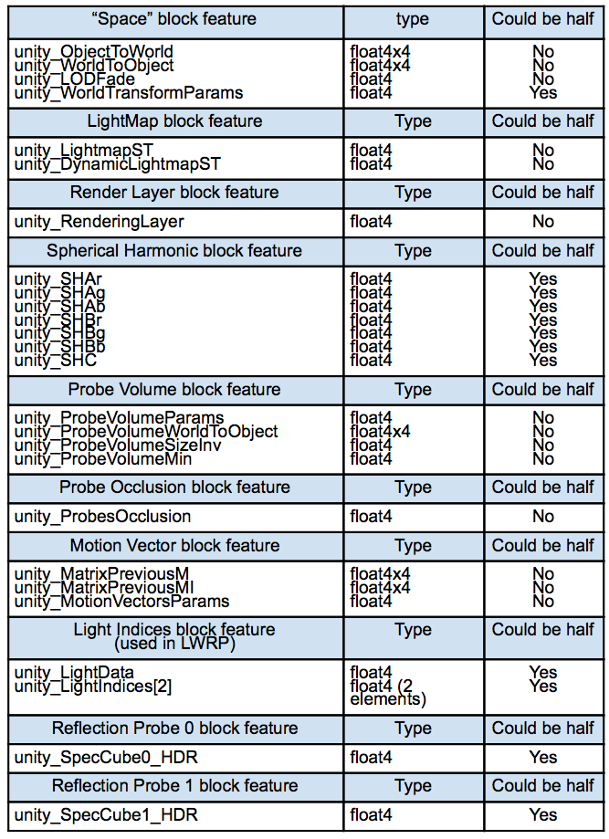
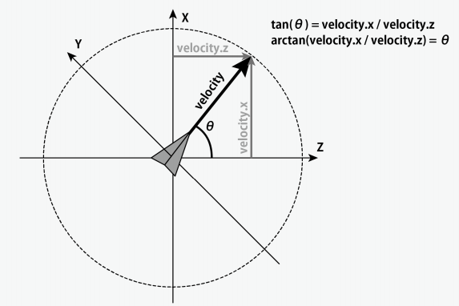

# 鱼群模拟
本篇通过Graphics.DrawMeshInstancedIndirect指令批量绘制鱼群

# GPU Instancing自动合批
GPU Instance技术：大规模渲染相同mesh
    比如草/树等植被，锁链/铁路等拼接物
在Unity中通过自动合批的方式完成GPU Instance：
    1.shader支持GPU Instancing(先破坏SRP batch)
        使用MaterialPropertyBlock会破坏SRP batch
        Shader中定义关键字时使用#pragma multi_compile_instancing
    2.材质面板开启Enable GPU Instancing
        本质是用INSTANCING_ON分支下的逻辑 用InstanceID去访问逐实例数据
        不管是自动合批还是API合批 都不能省去#pragma multi_compile_instancing
    3.不支持SkinnedMeshRenderer
    4.参与合批的物体使用相同的mesh和材质球
    5.通过MaterialPropertyBlock添加逐实例的属性变化
相对于自动完成GPU Instance，Unity也有接口手动完成该合批操作

# MaterialPropertyBlock添加逐实例的属性变化
参考测试场景：testAutoInstanced

注：本例中_Color将作为逐实例属性 如果对非逐实例属性进行赋值会打断本合批
    Unity会帮助我们将Transform信息也作为逐实例属性
    UnityPerDraw中包含的属性：
     
注：TransformObjectToHClip这种封装过的方法是兼容GPU Instancing的
    在GPU Instancing模式下用instanceID去查找当前实例的参数
    参考：`Packages/com.unity.render-pipelines.core/ShaderLibrary/UnityInstancing.hlsl`

# 通过API直接调用DrawMeshInstanced
参考测试场景：testDrawMeshInstanced

在Frame Debugger中的draw call表现为“Draw Mesh (instanced) ObjectName”。
指定instance次数，不进行CPU端的可见性剔除，避免GameObject开销
    参考文章：https://zhuanlan.zhihu.com/p/403885438
移动物体时，需要大量执行循环语句。

# 通过API直接调用DrawMeshInstancedIndirect
参考测试场景：testDrawMeshInstancedIndirect

声明绘制次数的参数声明在bufferWithArgs供GPU访问 其中5个int分别表示：
    ▲index count per instance：submesh中Indices的长度
        可以精确到只渲染某些面
    ▲instance count：生成的实例数量
    ▲start index location：默认0 (mesh中的复数submesh分别存储数据时)在Indices的起始值 
    ▲base vertex location：默认0 (mesh中的复数submesh分别存储数据时)在Vertices的起始值
    ▲start instance location：默认0 实例ID的的偏移量
而这5个值需要我们对submesh的结构有所了解：
    Indices：对于三角形拓扑的模型来说每个面对应3个顶点 Indices描述三角形每个面的顶点构成
        比如{0, 1, 2, 0, 2, 3}表示2个三角形
    Vertices: 顶点列表 每个顶点编号是顶点列表中的index

    Unity中并没有直接的submesh类型，Unity通过Mesh类型封装了submesh
    在Blender中，将多个mesh合并为一个大的mesh，每一个submesh都必须配一个材质球
    mesh.subMeshCount：返回mesh中包含的submesh数量
    mesh.GetIndexCount：返回指定submesh的Indices长度
    mesh.GetTopology：返回拓扑形式
    mesh.GetIndices/SetIndices：将submesh设置为点/线/三角面等拓扑(submesh's index buffer)
    mesh.GetTriangles/SetTriangles：将submesh设置为三角面拓扑
    mesh.GetIndexStart：返回submesh's index buffer在mesh's index buffer中的starting index
    mesh.GetBaseVertex：baseVertex = 顶点在整个mesh中的index - 顶点在submesh中的index

#  Graphics.DrawProcedural
shader中生成程序化几何体 由一定数量的三角形(或者其他拓扑结构)构成
    不同于GeometryShader GeometryShader的复杂度更高需要手动计算拓扑
    例如：全屏后处理中就使用此方法生成覆盖屏幕的三角形
    例如：生成不连续三角面构成的怪异模型 由于没有提供完整的顶点数据需要在顶点Shader计算出顶点数据
        参考：Keijiro的NoiseBall3

# DrawMeshInstanced和DrawMeshInstancedIndirect的区别
DrawMeshInstance其实是对DrawMeshInstanceIndirect的一种包装
DrawMeshInstance相对来说是更友好的绘制网格的方式 因为它不需要维护ComputeBuffer
    如果需要动态修改逐实例数据还需要写ComputeShader 这个比较有门槛
    通过MaterialPropertyBlock存储数据在ConstantBuffer
        名称为UnityInstancing_XXX的ConstantBuffer 内部是长度为实例数量的struct类型
DrawMeshInstanced最多绘制1023次 DrawMeshInstancedIndirect没有限制
DrawMeshInstanced需要上传Transform和逐实例数据 DrawMeshInstancedIndirect没有限制
    DrawMeshInstancedIndirect在GPU上使用ComputeBuffer存储数据
两者的区别主要体现在Transform和逐实例数据的更新方式上
    一个靠CPU算 一个靠GPU算
如果实例的Transform不会发生变化 DrawMeshInstanced会略微消耗CPU时间和带宽 但是影响不大
    
# 鱼群模拟实现
通过对比API可以得出，通过DrawMeshInstancedIndirect动态更新Transform可以批量绘制鱼群。
代价就是需要写ComputeShader更新逐实例数据到ComputeBuffer。另外我们得考虑鱼群(Boids)算法的规则。         
    1.离群：个体与在一定范围内的其他个体过于密集时避开 
    2.整列：个体倾向于向在一定范围内的其他个体的平均方向移动 
    3.结合：个体倾向于向在一定范围内的其他个体的平均位置移动
ComputeShader语法相关介绍在UGP1-2章节。
每个Thread都要与所有Thread都进行了一次互动 运算量是指数级的 用CPU算几乎不现实
    如果是CPU侧可能要进行体素化 只判断相邻体素内的实例减少运算量

参考测试场景：testDrawMeshInstancedIndirect

ComputeShader线程管理：每个Group中线程数量是SIMULATION_BLOCK_SIZE Group数量是MaxObjectNum/SIMULATION_BLOCK_SIZE
    总共有MaxObjectNum个Thread 分成了MaxObjectNum/SIMULATION_BLOCK_SIZE个Group
充分利用组内共享缓存加速遍历逻辑：groupshared BoidData boid_data[SIMULATION_BLOCK_SIZE];
利群/整列/结合等逻辑的实现参看代码，算法比较简单，主要是异步读写导致代码阅读困难。

Shader部分的看点主要在方法 ComputeObjectToWorldTransform
    通过instanceId取出当前实例的数据 有速度单位向量和位置
    基本思路是依次应用3个矩阵：mul(偏移, mul(旋转, 缩放))
    先将速度单位向量转化为欧拉角再转化为矩阵 得到旋转矩阵
        这个过程中不可避免的有很多三角函数运算 消耗很多性能
        欧拉角转矩阵的公式可以通过三个单轴旋转矩阵相乘得到
        参考图

# 其他问题
ComputeShader的平台支持：GLES3.1, SystemInfo.supportsComputeShaders
    https://zhuanlan.zhihu.com/p/483482044
    useStructuredBuffer(SSBO) or UniformBuffer(UBO)
Unity定义的 unity_BaseInstanceID 是什么：
    参考：https://forum.unity.com/threads/instance-id-in-shader.501821
    假设场景中有100个Cube和100个Sphere，他们共享一个material。
        自动合批模式下，使用2个GPU Instancing draw call分别绘制Cube和Sphere。
        第1个draw call中 unity_BaseInstanceID 为0，第二个为100。 
        通常unity_BaseInstanceID在每次draw call都会重置，因此它不会随帧或时间积累。
        unity_BaseInstanceID 仅用于在同material的多个instanced draw call之间共享instancing array。