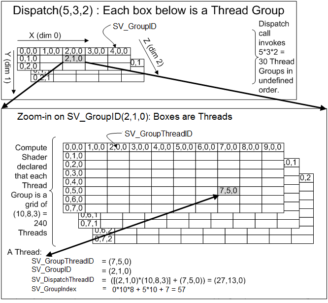

# ComputeShader语法
ComputeShader用于征调GPU的通用并行算力，减轻CPU负担。

# 线程组
参考：[微软DX官方文档](https://docs.microsoft.com/en-us/windows/win32/direct3dhlsl/sv-dispatchthreadid "微软DX官方文档")

ComputeShader的高并发运算时线程如何规划是一个问题
在C#端我们通过API发起Dispatch指令：
    int kernelIndex = computeShader.FindKernel("KernelName");
    computeShader.Dispatch(kernelIndex, threadGroupsX, threadGroupsY, threadGroupsZ);
在ComputeShader端还有一个[numthreads(dimx, dimy, dimz)] 类似xyz的计数方式都是三位数组
    实际的线程总数 = Group数量 * Group内线程的数量
        = (threadGroupsX * threadGroupsY * threadGroupsZ) * (dimx * dimy * dimz)
    为了简化计算我们可以降低维度到一维 使threadGroupsY/threadGroupsZ/dimy/dimz的值都为1
        那么实际的线程总数 = threadGroupsX * dimx
    所以我们现在有1个Dispatch，Dispatch里有很多个Group，Group里有很多个Thread。

uint3 SV_GroupThreadID ：Group内Thread的坐标，范围在(dimx, dimy, dimz)内
uint3 SV_GroupID ：Dispatch内Group的坐标, 范围在(threadGroupsX, threadGroupsY, threadGroupsZ)内
uint3 SV_DispatchThreadID ：Dispatch内Thread的坐标
    SV_DispatchThreadID = (dimx, dimy, dimz) * SV_GroupID + SV_GroupThreadID
uint SV_GroupIndex ：SV_GroupThreadID的一元表达形式，用于索引。
    SV_GroupIndex = SV_GroupThreadID.z * dimx * dimy + SV_GroupThreadID.y * dimx + SV_GroupThreadID.x

# 常规语法
变量声明：带RW的表示支持写入
    RWStructuredBuffer<int> intBuffer;
    RWStructuredBuffer<float3> outPositions;
    RWTexture2D<float4> textureBuffer;
    StructuredBuffer<float3> inPositions;
    int intValue;
    float floatValue;

Kernel声明：Kernel方法都是void的 主要用途是向ComputeBuffer里写入值
    #pragma kernel KernelName
    [numthreads(4, 1, 1)] 
    void KernelName(uint3 groupThreadID : SV_GroupThreadID, uint3 dispatchThreadID : SV_DispatchThreadID) 
    { 
        intBuffer[groupThreadID.x] += 1; 
        float width, height;
        textureBuffer.GetDimensions(width, height); //获取Texture2D的宽高
        textureBuffer[dispatchThreadID.xy] = float4(0,0,0,1);
    } 
    
# 初始化Buffer
基础语法：ComputeBuffer intComputeBuffer = new ComputeBuffer(4, sizeof(int)); 
    Buffer中可以存储任意结构体数组 需要指定数组长度和结构体的size
    使用 Marshal.SizeOf 方法可以获取结构体的长度
    
    public struct someData {} //声明一个值类型
    NativeArray<someData> data = new NativeArray<someData>(4, Allocator.Temp); //创建值类型数组
    for (int i = 0; i < 4; ++i)
        data[i] = i; //为数组赋值 
    intComputeBuffer.SetData(data);
    cmd.SetGlobalBuffer(m_intComputeBufferId, intComputeBuffer); //作为全局参数
    computeShader.SetBuffer(kernelId, "intBuffer", intComputeBuffer); //作为本地参数
    computeShader.SetInt("intValue", 1);  //非Buffer类型对象无需指定kernelId
    
创建Texture类型的可读写对象： 
    RenderTexture rt = new RenderTexture(512, 512, 0, RenderTextureFormat.ARGB32);
    rt.enableRandomWrite = true; 
    //随机读写参考：https://docs.unity3d.com/ScriptReference/RenderTexture-enableRandomWrite.html
    rt.Create(); 
    computeShader.SetTexture(kernelId, "textureBuffer", rt);
    
    
获取Buffer中的数据： 
    int[] result = new int[4]; 
    intComputeBuffer.GetData(result);
释放Buffer: intComputeBuffer.Release(); 

# GPU构架与数据存储位置

基本原则是离寄存器越近的存储区域访问速度越快但是容量越小
groupshared：Group内共享的一块内存 基于这块内存可以实现很多高效的算法
    多线程同时对groupshared变量进行写入时，有读写冲突风险需要自行规避。
        所有Group内的Thread都有对groupshadred变量的读权限
        使用 SV_GroupIndex 以保证多Threads之间不会发生冲突
        通过异步同步指令来调度线程来阶段性完成多次读写操作