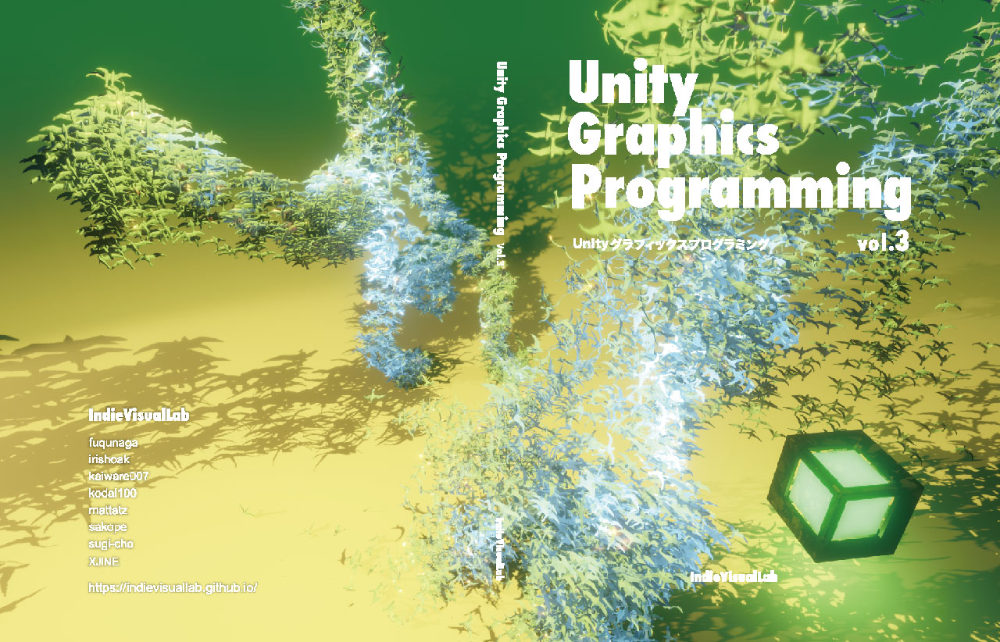

# UnityGraphicsProgramming3FrontCover

技術同人誌「Unity Graphics Programming vol.3」 表紙グラフィックス作成のためのUnityプロジェクト

第1章「Baking Skinned Animation to Texture」のプログラムをもとに作成しています.

[BakingSkinnedAnimationToTexture](https://github.com/IndieVisualLab/UnityGraphicsProgramming3/tree/master/Assets/BakingSkinnedAnimationToTexture)

- [vimeo](https://vimeo.com/293139321)

#### 操作
sキーを押すと、指定のフォルダにpng形式で画面のキャプチャを保存します.

#### Licence

[MIT](https://github.com/IndieVisualLab/UnityGraphicsProgramming3FrontCover/blob/master/LICENSE)

#### Author

[sugi-cho](https://github.com/sugi-cho)
